# Getting started

## 1. Synopsis
XAVIER pipeline can be executed from either using the graphical user interface (GUI) or the command line interface (CLI). GUI offers a more interactive way for the user to provide input and adjust parameter settings.
This part of the documentation describes how to run xavier using the GUI (with screenshots). See [Command Line](run.md) tab to read more about the `xavier` executable and running XAVIER pipeline using the CLI.

## 2. Setting up XAVIER

### 2.1 Login to cluster
```bash
# Setup Step 1.) ssh into cluster's head node
# example below for Biowulf cluster
ssh -Y $USER@biowulf.nih.gov
```
### 2.2 Grab an interactive node
```bash 
# Setup Step 2.) Please do not run XAVIER on the head node!
# Grab an interactive node first
sinteractive --time=12:00:00 --mem=8gb  --cpus-per-task=4
```

### 2.3 Load `ccbrpipeliner` module

_NOTE: `ccbrpipeliner` is a custom module created on biowulf which contains various NGS data analysis pipelines developed, tested, and benchmarked by experts at CCBR._

```bash 
# Setup Step 3.) Add ccbrpipeliner module
module purge # to reset the module environment
module load ccbrpipeliner
```

If the module was loaded correctly, the greetings message should be displayed.

```bash
[+] Loading ccbrpipeliner  5  ... 
###########################################################################
                                CCBR Pipeliner
###########################################################################
    "ccbrpipeliner" is a suite of end-to-end pipelines and tools
    Visit https://github.com/ccbr for more details.
    Pipelines are available on BIOWULF and FRCE.
    Tools are available on BIOWULF, HELIX and FRCE.

    The following pipelines/tools will be loaded in this module:

    RENEE v2.5 https://ccbr.github.io/RENEE/
    XAVIER v3.0 https://ccbr.github.io/XAVIER/
    CARLISLE v2.4 https://ccbr.github.io/CARLISLE/
    CHAMPAGNE v0.2 https://ccbr.github.io/CHAMPAGNE/
    CRUISE v0.1 https://ccbr.github.io/CRUISE/

    spacesavers2 v0.10 https://ccbr.github.io/spacesavers2/
    permfix v0.6 https://github.com/ccbr/permfix
###########################################################################
Thank you for using CCBR Pipeliner
###########################################################################
```

To check the current version of XAVIER, enter: 
```bash
xavier --version
```

## 3. Running XAVIER

### 3.1 Launching XAVIER GUI

To run the XAVIER pipeline from the GUI, simply enter:
```bash
xavier_gui
```
and it will launch the XAVIER window.
> Note: Please wait until `window created!` message appears on the terminal.

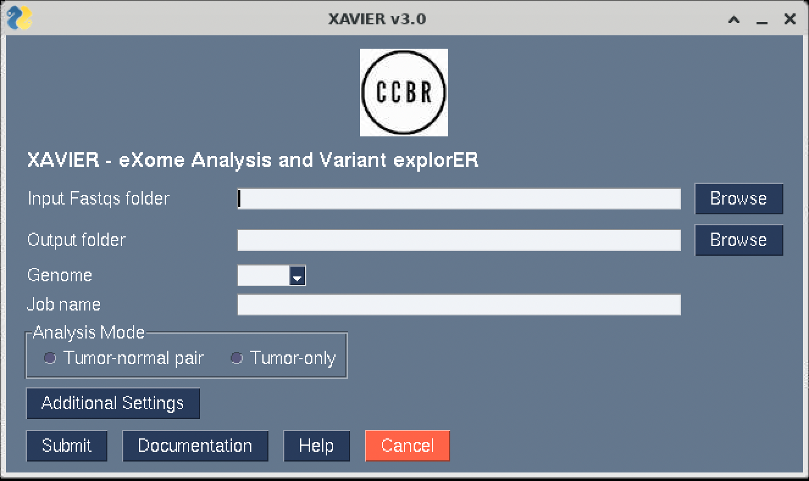

### 3.2 Folder paths and reference genomes
To enter the location of the input folder containing FASTQ files and the location where the output folders should be created, either simply type the absolute paths

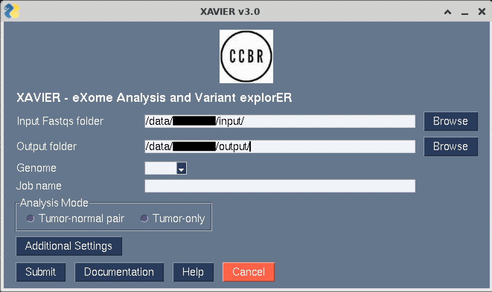

or use the **Browse** tab to choose the input and output directories

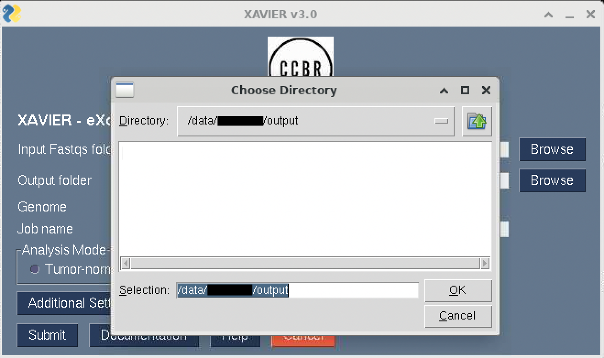

Next, from the drop down menu select the reference genome (hg38/mm10)

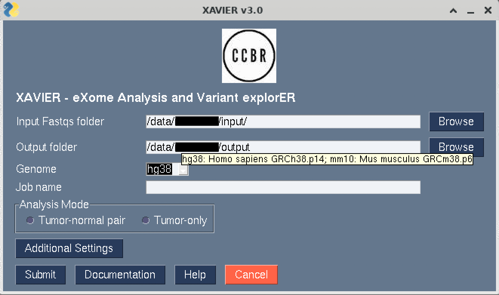

and enter a job name of this run.

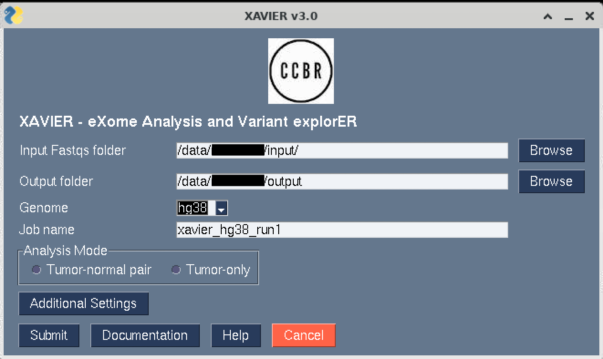

### 3.3 Analysis mode

XAVIER pipeline can be run in two different modes:\
(A) Tumor-normal pair \
(B) Tumor-only

#### 3.3a Tumor-normal pair analysis

In case of tumor-normal pairs, a tab-delimited text file is neeed that contains the list of normal and tumor samples. For example,
```bash
Normal  Tumor
sample1-normal     sample1-tumor
sample2-normal     sample2-tumor
sample3-normal     sample3-tumor
sample4-normal     sample4-tumor
```

Similar to input and output folder paths, either type the path to the pairsInfo.txt file or use the **Browse** tab.

In case of paired mode, XAVIER can also perform copy number variants (CNV) analysis.

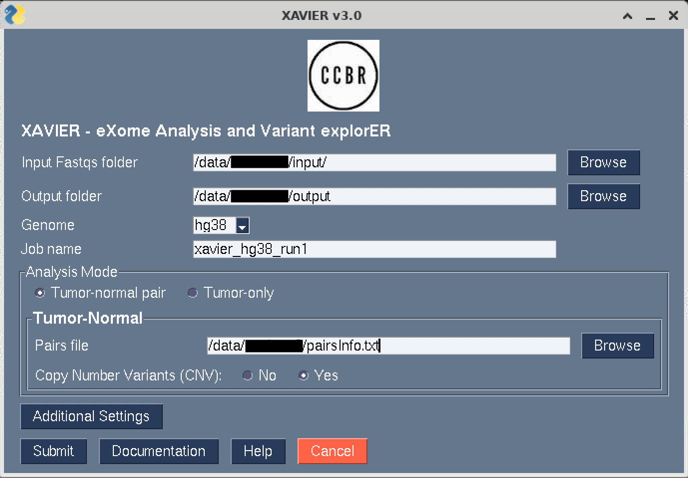

#### 3.3b Tumor-only analysis

In case the paired normal samples are unavailable, XAVIER pipeline can be run in tumor-only mode which does not require paired samples information. However, in the absence of matching normal samples, CNV analysis is also unavailable.

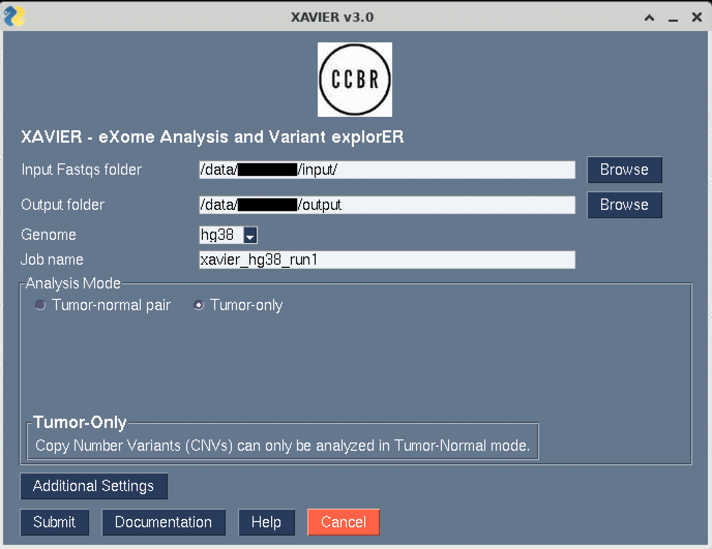

### 3.4 Submit XAVIER job

After all the information is filled out, press **Submit**.

If the pipeline detects no errors and the run was submitted, a new window appears that has the output of a "dry-run" which summarizes each step of the pipeline. 

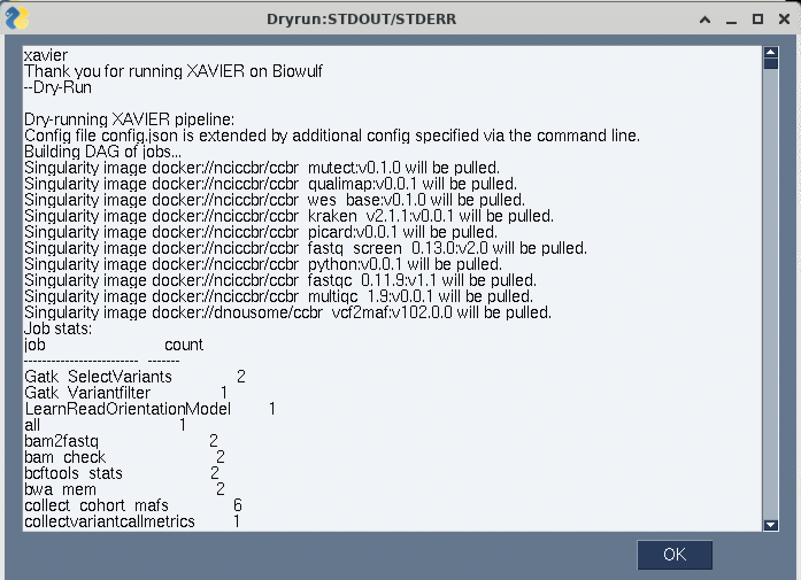

Click **OK**

A dialogue box will popup to confirm submitting the job to slurm.

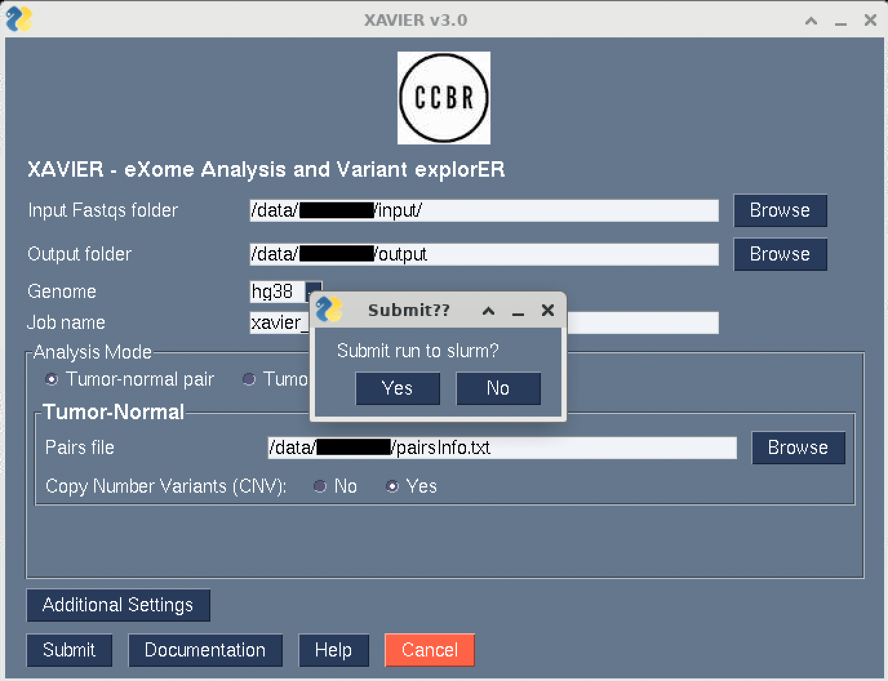

Click **Yes**

The dry-run output will be displayed again and the master job will be submitted.
An email notification will be sent out when the pipeline starts and ends.

The XAVIER gui will ask to submit another job.

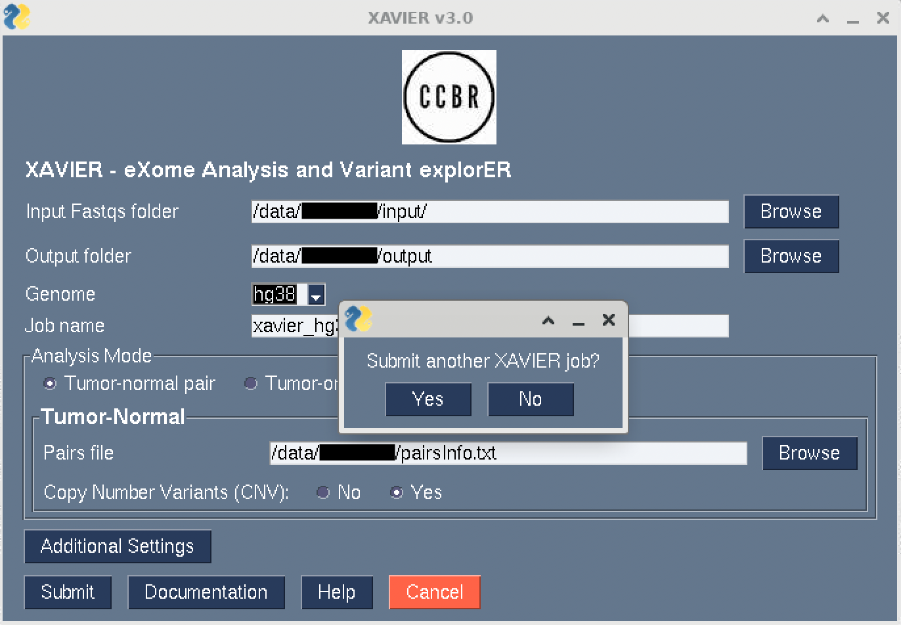

Click **Yes** to start again or **No** to close the XAVIER gui.


### 3.5 Additional settings

Users can input certain additional settings for the pipeline run including running an additional step to correct strand orientation bias in Formalin-Fixed Paraffin-Embedded (FFPE) samples and to provide a custom exome targets BED file. This file can be obtained from the manufacturer of the target capture kit that was used.

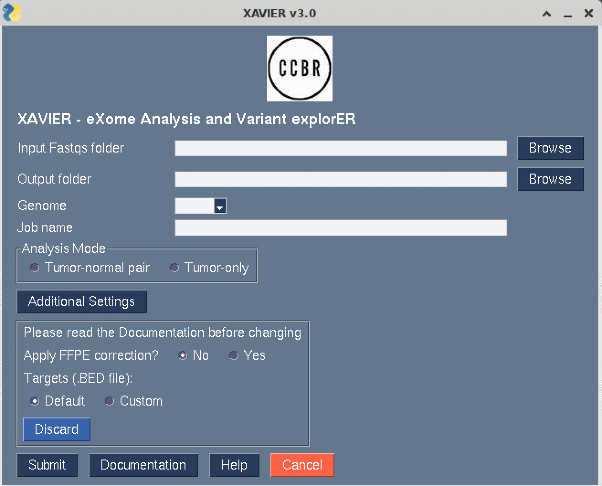

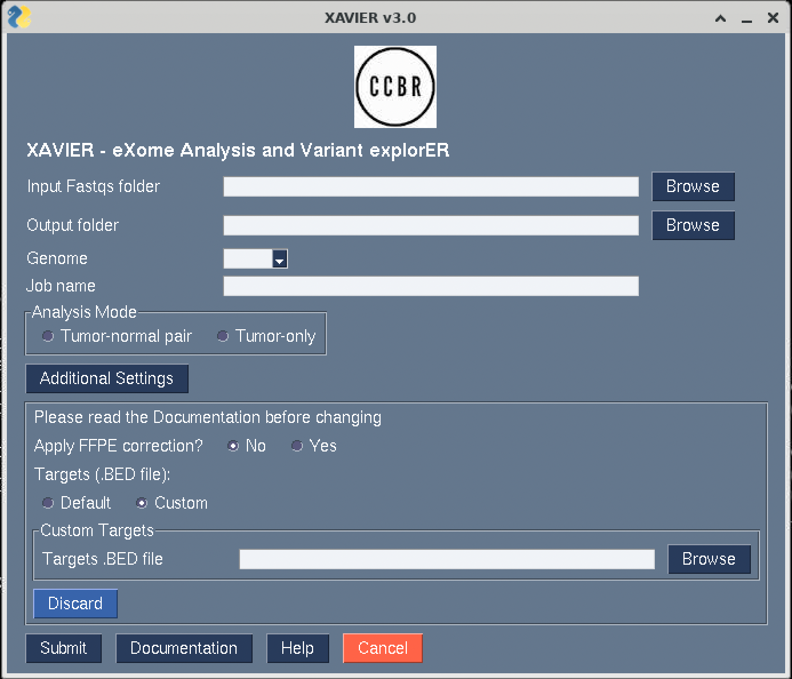


## 4. Special instructions for Biowulf

XAVIER GUI natively uses the X11 Window System to run XAVIER pipeline and display the graphics on a personal desktop or laptop. However, if running XAVIER specifically on NIH's Biowulf cluster, the HPC staff recommends NoMachine (NX) to run graphics applications.

Please see details [here](https://hpc.nih.gov/docs/nx.html) on how to install and connect to Biowulf on your local computer using NoMachine.

Once connected to Biowulf using NX, right click to open a terminal connection

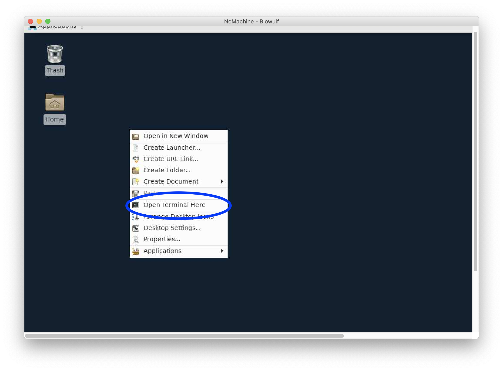

and start an interactive session.

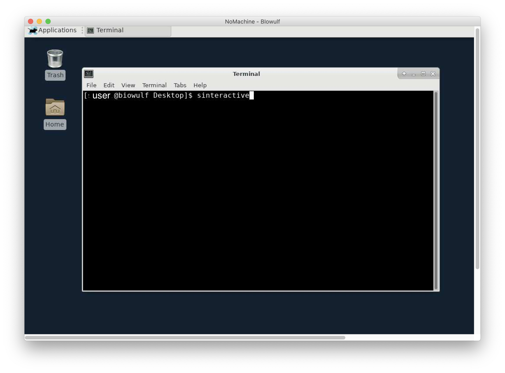

Similar to the instructions above, load `ccbrpipeliner` module and enter `xavier_gui` to launch the XAVIER gui.

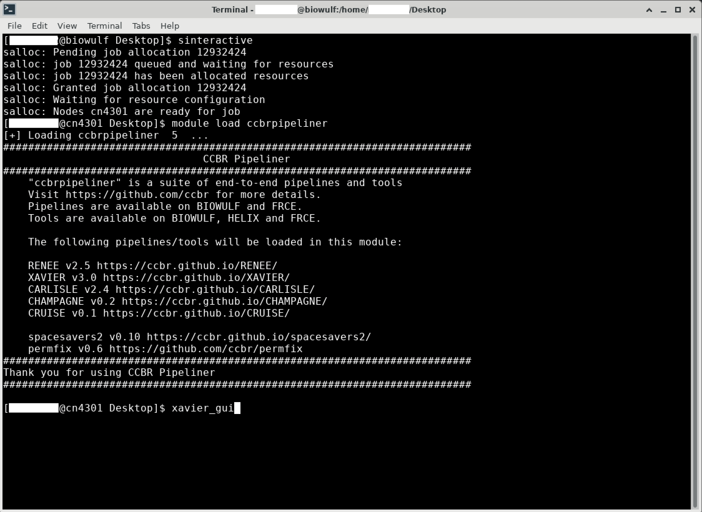